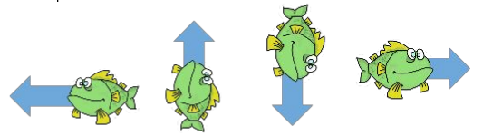
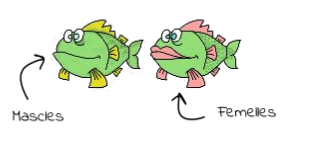
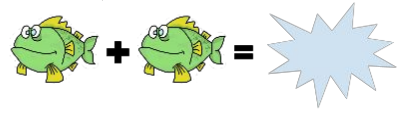
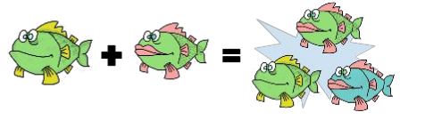
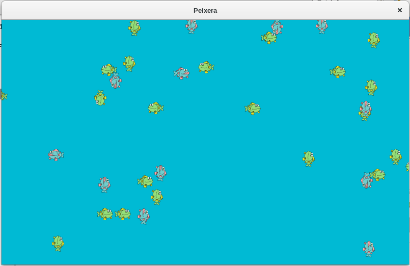

Una nova peixera
=========================
En una peixera hi ha una quantitat de peixos que es mouen seguint sempre la mateixa direcció.

> Com que la peixera (en realitat) és esfèrica no els cal canviar de direcció per donar voltes i per això no ho fan mai.

En la peixera hi ha peixos dels dos sexes: Mascles i femelles

Els peixos d’aquestes espècies són molt especials:

* Odien els peixos del seu mateix sexe i si es troben es barallen fins a la mort (i sempre moren tots dos)

* En canvi estimen tant els peixos de l’altre sexe que s’hi reprodueixen instantàniament.
Són tant fèrtils que el resultat de la unió sempre és un peix nou (el 50% mascles  i el 50% femelles)

Activitat
-------------------
1. Desenvolupeu un programa fent servir la llibreria gràfica ACM que simuli el comportament dels peixos en la peixera fins que arribi a un punt en que no pugui passar res: no queden peixos, només en queda un, …

    * Proveu el que passa posant 25 peixos de cada sexe

    
