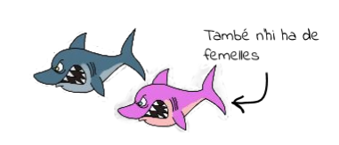
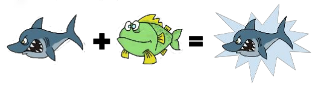

La peixera contrataca
=========================
En una peixera hi ha una quantitat de peixos que es mouen seguint sempre la mateixa direcció.

> Com que la peixera (en realitat) és esfèrica no els cal canviar de direcció per donar voltes i per això no ho fan mai.

En la peixera hi ha peixos dels dos sexes: Mascles i femelles

Els peixos d’aquestes espècies són molt especials:

* Odien els peixos del seu mateix sexe i si es troben es barallen fins a la mort (i sempre moren tots dos)

* En canvi estimen tant els peixos de l’altre sexe que s’hi reprodueixen instantàniament.
Són tant fèrtils que el resultat de la unió sempre és un peix nou (el 50% mascles  i el 50% femelles)

Activitat
-------------------
1. L’amo de la peixera troba que és avorrida i per això ha decidit introduir-hi taurons.

* Els taurons d’aquesta espècie es comporten igual que els peixos de la peixera. De manera que:
    * Es mouen sempre en línia recta
    * Es barallen amb els del seu sexe i es reprodueixen amb els de l’altre sexe
* Però tenen tanta gana que es mengen tots els peixos que es troben (no importa de quin sexe siguin)

